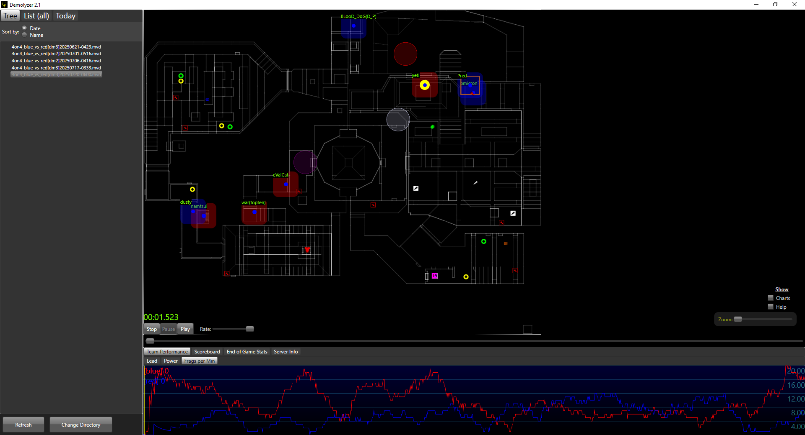

# Demolyzer

Demolyzer is a desktop application for analyzing QuakeWorld demos. It replays the events of a match from a bird's eye view, letting users monitor the activity of all players simultaneously. Additionally, it provides visualizations for various in-game statistics. Its creator, Cyanide, has graciously donated the source code to the community.

# Compilation

Demolyzer is a Windows Presentation Foundation (WPF) application. The most recent release was compiled with Visual Studio 2022 and .NET framework version 4.8.

## Dependencies

Source code for all dependencies is included in the project and gets built with the main executable.
